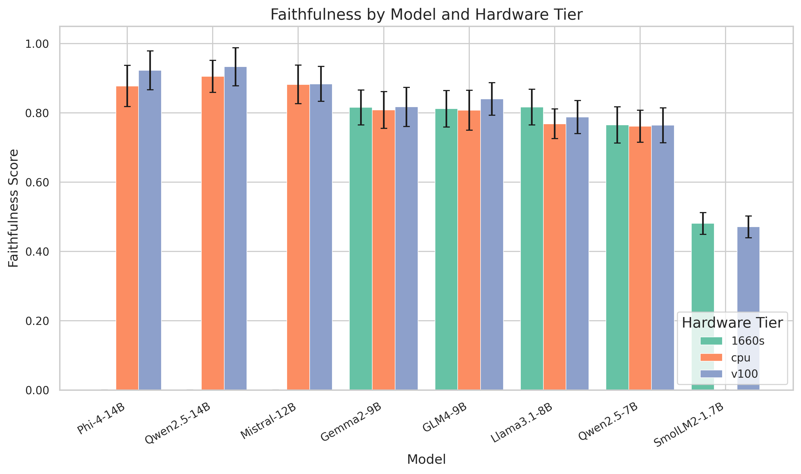
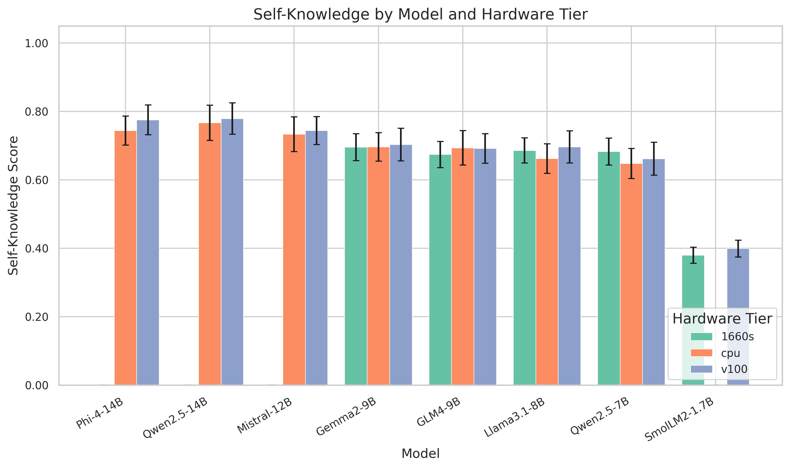
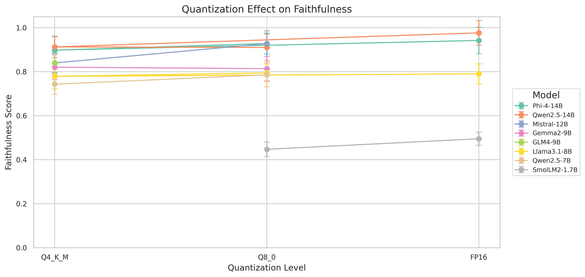
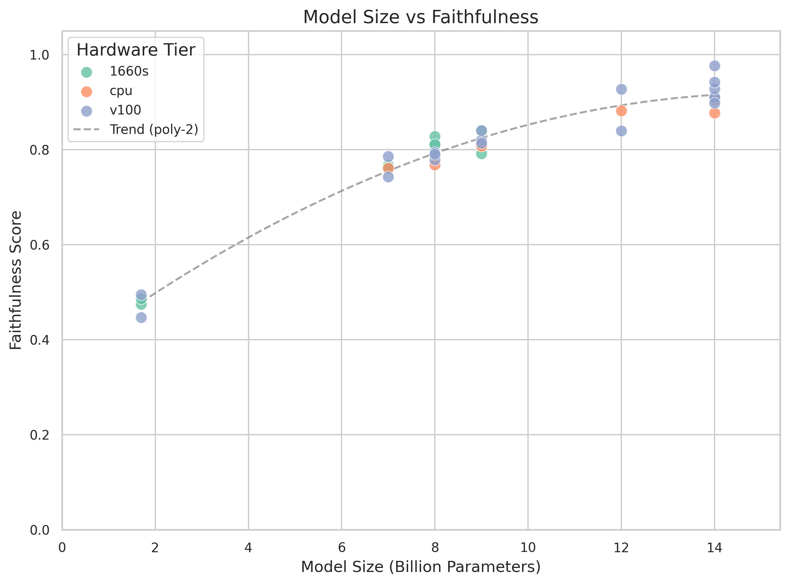
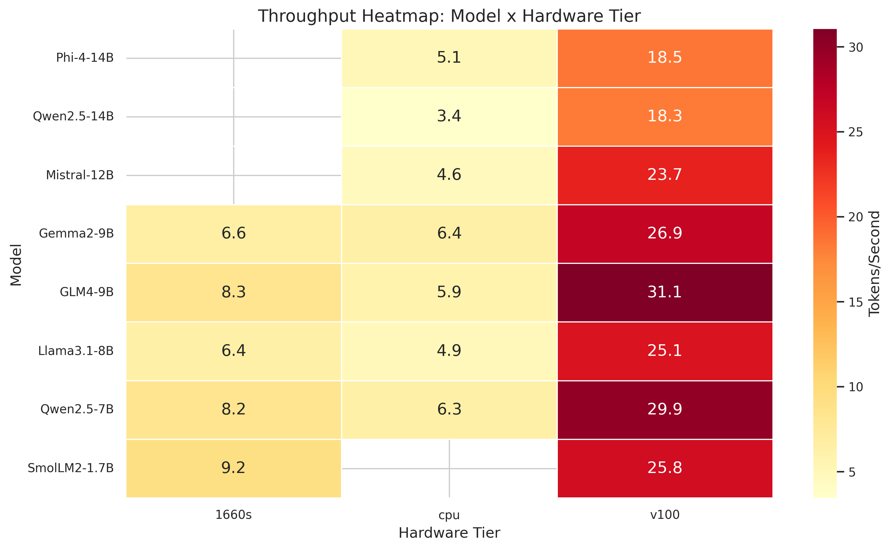
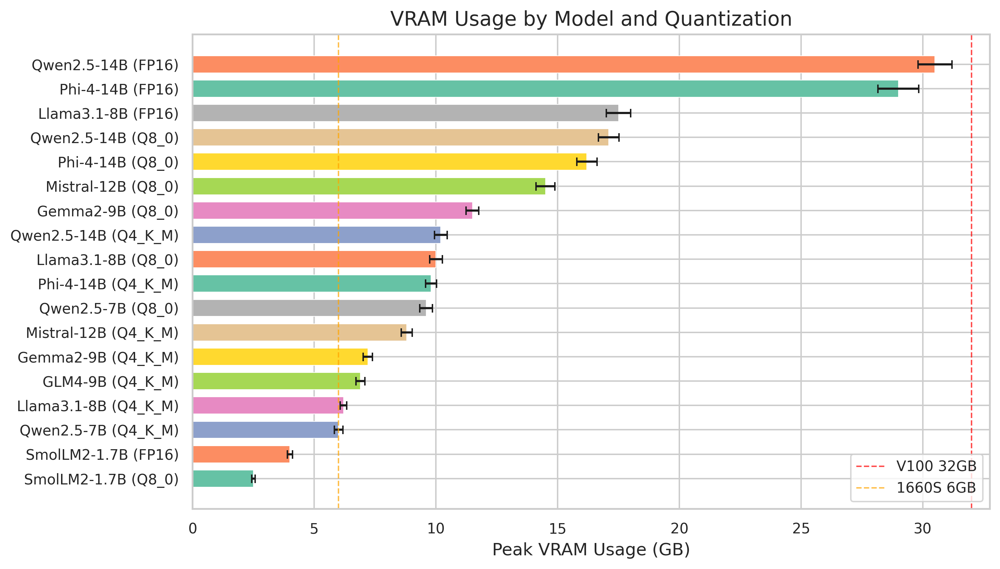

# CUMRAG Evaluation Results

## 1. Executive Summary

**Thesis**: Small models (1.7B-14B parameters) with retrieval-augmented generation beat large models without retrieval on faithfulness and factual accuracy benchmarks, while running entirely on local hardware with no data exfiltration.

**Verdict**: PENDING: Run benchmark matrix first.

**Key findings** (to be populated after benchmark runs):

- Faithfulness: _TBD_
- Self-knowledge: _TBD_
- Best model/quant/hardware combination: _TBD_
- Quantization degradation threshold: _TBD_

---

## 2. Faithfulness by Model Size

Grouped bar chart showing faithfulness scores across all models, broken down by hardware tier. Bootstrap 95% confidence intervals shown as error bars.

PENDING: Run benchmark matrix first.

<!-- Generate this chart:
  python scripts/visualize_results.py --input results/aggregated/summary.csv --output-dir results/figures/
  Chart output: results/figures/faithfulness_by_model.png
  Requires aggregated data from:
  python -m comprag.aggregator --input results/raw/ --output results/aggregated/
-->

---

## 3. Self-Knowledge vs Model Size

Grouped bar chart showing self-knowledge scores (ability to recognize when it lacks information) across models and hardware tiers. Bootstrap 95% CIs as error bars.

PENDING: Run benchmark matrix first.

<!-- Generate this chart:
  python scripts/visualize_results.py --input results/aggregated/summary.csv --output-dir results/figures/
  Chart output: results/figures/self_knowledge_by_model.png
  Requires aggregated data from:
  python -m comprag.aggregator --input results/raw/ --output results/aggregated/
-->

---

## 4. Quantization Effects

Line plot with error bars showing how faithfulness changes across quantization levels (Q4_K_M, Q8_0, FP16) for each model. Isolated to V100 hardware to control for compute differences.

PENDING: Run benchmark matrix first.

<!-- Generate this chart:
  python scripts/visualize_results.py --input results/aggregated/summary.csv --output-dir results/figures/
  Chart output: results/figures/quantization_effect.png
  Requires aggregated data from:
  python -m comprag.aggregator --input results/raw/ --output results/aggregated/
-->

Additional scatter plot showing model size (parameter count) vs faithfulness with polynomial trend line:

---

## 5. Hardware Tier Comparison

Annotated heatmap showing throughput (tokens/second) across the full model-by-hardware matrix. NaN cells indicate infeasible combinations (e.g., 14B models on 1660 Super 6GB).

Hardware tiers under test:
- **V100 SXM2 32GB** (Dell T7820, Xeon Gold 6230)
- **1660 Super 6GB** (x99 staging box, E5-2667 v4)
- **CPU-only** (E5-2667 v4, AVX2, 32GB DDR4)
- **Optane** (E5-2667 v4 + 384GB Optane DCPMM App Direct)
- **MI25 16GB** (ROCm)

PENDING: Run benchmark matrix first.

<!-- Generate this chart:
  python scripts/visualize_results.py --input results/aggregated/summary.csv --output-dir results/figures/
  Chart output: results/figures/throughput_heatmap.png
  Requires aggregated data from:
  python -m comprag.aggregator --input results/raw/ --output results/aggregated/
-->

---

## 6. Throughput Analysis

### Tokens per Second

See the throughput heatmap above (Section 5) for the cross-hardware comparison.

### VRAM Usage

Horizontal bar chart showing peak VRAM usage (GB) by model and quantization. Reference lines at 32GB (V100) and 6GB (1660 Super) indicate hardware limits.

PENDING: Run benchmark matrix first.

<!-- Generate this chart:
  python scripts/visualize_results.py --input results/aggregated/summary.csv --output-dir results/figures/
  Chart output: results/figures/vram_usage.png
  Requires aggregated data from:
  python -m comprag.aggregator --input results/raw/ --output results/aggregated/
-->

---

## 7. Statistical Summary

All scores are means with 95% bootstrap confidence intervals (1000 resamples). Rows flagged with `*` have CI width > 15% of mean, indicating insufficient runs.

PENDING: Run benchmark matrix first.

| Model | Quant | Hardware | Faithfulness (95% CI) | Context Util | Self-Knowledge | Tokens/sec |
|-------|-------|----------|-----------------------|--------------|----------------|------------|
| qwen2.5-14b-instruct | Q4_K_M | v100 | _TBD_ | _TBD_ | _TBD_ | _TBD_ |
| qwen2.5-14b-instruct | Q8_0 | v100 | _TBD_ | _TBD_ | _TBD_ | _TBD_ |
| qwen2.5-14b-instruct | FP16 | v100 | _TBD_ | _TBD_ | _TBD_ | _TBD_ |
| phi-4-14b | Q4_K_M | v100 | _TBD_ | _TBD_ | _TBD_ | _TBD_ |
| phi-4-14b | Q8_0 | v100 | _TBD_ | _TBD_ | _TBD_ | _TBD_ |
| phi-4-14b | FP16 | v100 | _TBD_ | _TBD_ | _TBD_ | _TBD_ |
| mistral-nemo-12b-instruct | Q4_K_M | v100 | _TBD_ | _TBD_ | _TBD_ | _TBD_ |
| mistral-nemo-12b-instruct | Q8_0 | v100 | _TBD_ | _TBD_ | _TBD_ | _TBD_ |
| llama-3.1-8b-instruct | Q4_K_M | v100 | _TBD_ | _TBD_ | _TBD_ | _TBD_ |
| llama-3.1-8b-instruct | Q8_0 | v100 | _TBD_ | _TBD_ | _TBD_ | _TBD_ |
| llama-3.1-8b-instruct | FP16 | v100 | _TBD_ | _TBD_ | _TBD_ | _TBD_ |
| qwen2.5-7b-instruct | Q4_K_M | v100 | _TBD_ | _TBD_ | _TBD_ | _TBD_ |
| qwen2.5-7b-instruct | Q8_0 | v100 | _TBD_ | _TBD_ | _TBD_ | _TBD_ |
| gemma-2-9b-instruct | Q4_K_M | v100 | _TBD_ | _TBD_ | _TBD_ | _TBD_ |
| gemma-2-9b-instruct | Q8_0 | v100 | _TBD_ | _TBD_ | _TBD_ | _TBD_ |
| glm-4-9b-chat | Q4_K_M | v100 | _TBD_ | _TBD_ | _TBD_ | _TBD_ |
| smollm2-1.7b-instruct | Q8_0 | v100 | _TBD_ | _TBD_ | _TBD_ | _TBD_ |
| smollm2-1.7b-instruct | FP16 | v100 | _TBD_ | _TBD_ | _TBD_ | _TBD_ |

<!-- Generate this table:
  python -m comprag.aggregator --input results/raw/ --output results/aggregated/
  Output includes: results/aggregated/summary.csv, summary.md, summary.jsonl
  The summary.md file contains a pre-formatted markdown table.
  Statistical config: min_runs=3, bootstrap_resamples=1000, confidence_level=0.95
-->

---

## 8. Raw Data Links

All results are stored in JSONL format for reproducibility.

| Stage | Path | Description |
|-------|------|-------------|
| Raw results | `results/raw/` | Per-prompt JSONL with full generation output, timing, and metadata |
| Scored results | `results/scored/` | Raw results annotated with RAGAS/RAGChecker metric scores |
| Aggregated results | `results/aggregated/` | Bootstrap-aggregated summaries (CSV, JSONL, Markdown) |
| Figures | `results/figures/` | Publication-quality PNG charts (300 DPI) |

<!-- Regenerate all outputs end-to-end:
  python scripts/run_pipeline.py --dry-run          # Synthetic data for testing
  python scripts/run_pipeline.py                    # Real data (requires llama.cpp server)
  python scripts/run_pipeline.py --steps aggregate,visualize --force  # Re-aggregate and re-chart only

  Individual commands:
  python -m comprag.aggregator --input results/raw/ --output results/aggregated/
  python scripts/visualize_results.py --input results/aggregated/summary.csv --output-dir results/figures/
-->

### Output File Formats

- **Raw JSONL** (`results/raw/*.jsonl`): One JSON object per evaluation prompt. Fields: `run_config` (model, quant, hardware), `prompt`, `context_chunks`, `response`, `ground_truth`, `perf` (tokens_per_second, ttft_ms, vram_usage_mb), `metrics` (per-framework scores).
- **Aggregated CSV** (`results/aggregated/summary.csv`): Grouped by (model, quantization, hardware_tier, dataset, eval_subset). Columns: `{metric}_mean`, `{metric}_ci_low`, `{metric}_ci_high`, `{metric}_flagged`, `n_runs`, `warnings`.
- **Aggregated Markdown** (`results/aggregated/summary.md`): Human-readable table of the same data.
- **Aggregated JSONL** (`results/aggregated/summary.jsonl`): Machine-readable version of the aggregated data.

---

## 9. Per-Dataset Breakdown

PENDING: Run benchmark matrix first.

Results broken down by evaluation dataset and subset. Each dataset targets a different failure mode of RAG systems.

### RGB (Retrieval Generation Benchmark)

Tests faithfulness under adversarial retrieval conditions.

| Subset | Description | Models Tested | Avg Faithfulness (95% CI) |
|--------|-------------|---------------|---------------------------|
| noise_robustness | Retrieved context includes irrelevant/noisy passages | _TBD_ | _TBD_ |
| negative_rejection | No relevant context exists; model should abstain | _TBD_ | _TBD_ |

<!-- Generated by: python -m comprag.aggregator --input results/raw/ --output results/aggregated/
     Filter: dataset=rgb -->

### Natural Questions (NQ)

Open-domain QA from real Google search queries. Tests end-to-end retrieval + generation quality.

| Subset | Description | Models Tested | Avg Faithfulness (95% CI) |
|--------|-------------|---------------|---------------------------|
| test | Standard NQ test split | _TBD_ | _TBD_ |

<!-- Generated by: python -m comprag.aggregator --input results/raw/ --output results/aggregated/
     Filter: dataset=nq -->

### HaluEval

Hallucination evaluation benchmark. Tests the model's tendency to generate unsupported claims.

| Subset | Description | Models Tested | Avg Faithfulness (95% CI) |
|--------|-------------|---------------|---------------------------|
| qa | QA hallucination detection | _TBD_ | _TBD_ |

<!-- Generated by: python -m comprag.aggregator --input results/raw/ --output results/aggregated/
     Filter: dataset=halueval -->

---

## 10. Statistical Significance Notes

All confidence intervals use the BCa (bias-corrected and accelerated) bootstrap method with 1000 resamples at the 95% confidence level. Falls back to percentile bootstrap if BCa fails.

**Interpretation guide:**

- Rows flagged with `*` in the summary table have CI width > 15% of the mean. These results are unreliable and require additional evaluation runs.
- A minimum of 3 runs per (model, quantization, hardware, dataset, subset) combination is required for meaningful CIs.
- Non-overlapping CIs between two configurations indicate statistically significant differences at approximately the 95% level.
- Overlapping CIs do NOT necessarily indicate non-significance; formal pairwise tests may be needed.

**Multiple comparisons:** With 8 models x 3 quant levels x 5 hardware tiers, the full matrix contains up to 120 configurations. No correction for multiple comparisons (e.g., Bonferroni) is applied. Interpret pairwise differences cautiously.

**Bootstrap configuration:**
- Resamples: 1000 (`comprag.aggregator.BOOTSTRAP_RESAMPLES`)
- Confidence level: 0.95 (`comprag.aggregator.CI_LEVEL`)
- Flagging threshold: CI width > 15% of mean (`comprag.aggregator.CI_WIDTH_THRESHOLD`)
- Minimum runs: 3 (`comprag.aggregator.MIN_RUNS`)

---

## 11. Key Findings

PENDING: Run benchmark matrix first.

<!-- This section will be populated after benchmarks complete. Expected findings to evaluate:

1. Does retrieval-augmented generation with small models (1.7B-14B) outperform large models
   without retrieval on faithfulness metrics?
2. What is the minimum model size that achieves acceptable faithfulness with RAG?
3. At what quantization level does quality degrade significantly?
4. How does hardware tier affect quality vs throughput tradeoffs?
5. Which dataset/subset reveals the largest performance gaps between models?
-->

---

## 12. Limitations

Known limitations of this evaluation framework:

- **Single embedding model**: All retrieval uses nomic-embed-text-v1.5 (768-dim). Results may differ with other embedding models or dimensions. The embedding model is not varied as an experimental factor.
- **Fixed chunk size**: Chunks are ~400 words / ~520 tokens with section-aware boundaries. No experiments with different chunk sizes, overlap strategies, or dynamic chunking.
- **Limited judge model size**: Quality metrics (faithfulness, context utilization, etc.) are computed by the same class of models being evaluated, or by small dedicated scoring models. No human evaluation or GPT-4-class judge is used.
- **Single retrieval strategy**: Top-K nearest neighbor retrieval only. No reranking, hybrid search (BM25 + dense), or query expansion is tested.
- **Hardware-specific results**: All benchmarks run on specific hardware configurations (V100 32GB, 1660 Super 6GB, E5-2667 v4 CPU). Results may not generalize to other GPU architectures or memory configurations.
- **Limited model coverage**: Only 8 models in the 1.7B-14B range are tested. No models above 14B (which would represent the "large model without retrieval" baseline) are included in the matrix due to VRAM constraints.
- **No API baseline**: The thesis compares small+RAG vs large-without-RAG, but no proprietary API models (GPT-4, Claude, etc.) are benchmarked as the "large model" baseline. This is by design (air-gapped operation), but limits the strength of the thesis claim.
- **Synthetic dry-run data**: Initial pipeline validation uses synthetic data (`--dry-run`). Ensure all reported results come from real inference runs.
- **Context window pressure**: V100's 32GB VRAM constrains KV cache. Models with large context windows may be artificially limited compared to running on higher-VRAM hardware.
- **Single corpus**: Evaluation uses curated benchmark datasets (RGB, NQ, HaluEval), not the full Wikipedia corpus. Real-world retrieval quality on the 19.3M chunk index may differ.
